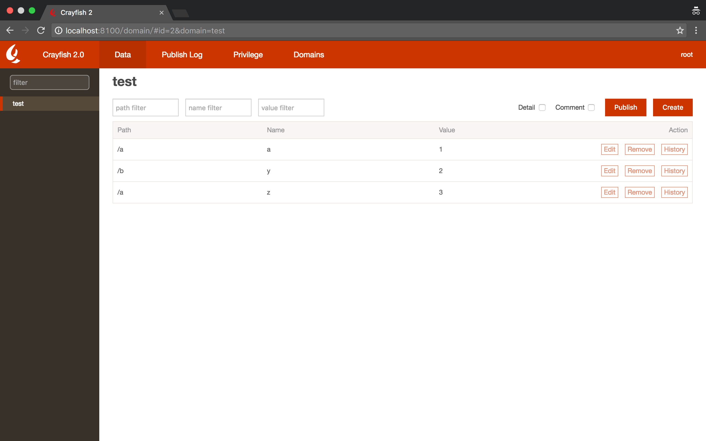

## 快速开始

### 1. 依赖

* Node Version: >= 5
* MySQL Version: >= 5.6

**注: MySQL 5.7 请关闭严格模式：<http://dev.mysql.com/doc/refman/5.7/en/sql-mode.html>。**

### 2. 安装与运行

首先为你的 MySQL 准备好一个 `crayfish` 数据库。可以在 `config.js` 和 `MAKEFILE` 中修改数据库。

安装并启动后端，如果没有任何错误，则为运行成功：

```shell
cd backend
make node_modules
make init-database
make run
```

Crayfish 的前端使用 [jinkela](https://github.com/YanagiEiichi/jinkela) 开发，并使用 [webspoon](https://github.com/ElemeFE/webspoon) 构建。

启动前端，前端会被后端的 `koa-static` 中间件加载：

```shell
cd frontend
make install
make dev
```

之后访问：<http://localhost:8100> 即可看到运行成功的 Crayfish。

如果需要在生产环境使用，在根目录 `make build` 即可。

## 日常操作

### 1. 进入 Crayfish 控制台

所有的操作都在 Crayfish 控制台上完成的。考虑到每个公司都有一套自己的用户系统，因此开源版本并没有实现用户认证机制，默认是以超级管理员身份进入。

在 `frontend/src/services/user.js` 中可以修改 `$user.SSOURL` 来控制接入的用户系统。

在 `backend/users.js` 中 mock 了一份用户系统数据供系统调用和参考。

### 2. 数据列表

进入项目后大概能看到这个界面：



中间这个最大的表格就是这个项目所有配置数据的列表了。

这个数据列表的操作权限是根据用户角色区分的。

如果你是开发人员，那你应该可以看到每条记录后面的「Edit」、「Remove」、「History」按钮，以及右上角的「Create」和「Publish」按钮。

如果你是产品经理或运营人员（对应「CHANGE」权限），你就看不到「Remove」和「Create」按钮。

之所以没有非开发人员开添加和删除的权限是因为每条记录都是和程序关联的。记录中的 `Name` 会被程序引用，而随便删除项可能导致某些容错没做好的程序崩掉。

### 3. 数据的编辑与发布

每条记录由 `Path`、`Name`、`Type`、`Value`、`Comment` 这四部分组成。

* `Path` 表示最终这些数据会在 CDN 上的哪个 URL Path。
* `Name` 表示这条记录在程序中的引用名称。
* `Type` 表示这条记录的数据类型。
* `Value` 表示这条记录的值。
* `Comment` 表示这条记录的注释，并不会对记录有实际影响。

发布到 CDN 时这些记录会根据 `Path` 聚合起来。

示例：

假如现在我们有个叫做 test 的项目，在这个项目中有这三条记录：

| Path | Name | Value |
| ---- | ---- | ----- |
| /a   | x    | 1     |
| /b   | y    | 2     |
| /a   | z    | 3     |

点击「Pubish」发布后，Crayfish 会将上面的三条记录聚合成两个文件，每个文件有三个版本可供使用。

#### 3.1. js 版本

js 版本不是直接的 json，而是一个将 json 赋值给名为 `crayfish` 的全局变量的 js 文件。

http://localhost:8100/test/a.crayfish

```js
var crayfish = {
  "x": 1,
  "z": 3
};
```

http://localhost:8100/test/b.crayfish

```js
var crayfish = {
  "y": 2
};
```

#### 3.2. json 版本

如果想要直接使用 json，可以在域名后面加上 `@json`。

http://localhost:8100/crayfish/test@json/a.crayfish

```js
{
  "x": 1,
  "z": 3
}
```

http://localhost:8100/crayfish/test@json/b.crayfish

```js
{
  "y": 2
}
```

#### 3.3. ref 版本

ref 版本类似于 js 版本，但是可以设置相应 `<script>` 标签的 `data-ref` 属性，指定将 json 赋值给哪个变量，防止引入多个文件的时候 `crayfish` 变量冲突。可以在域名后面加上 `@ref` 来使用 ref 版本。

```html
<!-- 未指定 data-ref，将 json 赋值给 window.crayfish -->
<script src="http://localhost:8100/test@ref/a"></script>
<!-- 将 json 赋值给 window.config -->
<script data-ref="config" src="http://localhost:8100/test@ref/b"></script>
<script>
  console.log(crayfish.z); // 3
  console.log(config.y); // 2
</script>
```

### 4. 操作历史

每条记录上都会有一个「History」的按钮，点击可以看到这条记录谁在什么时候编辑过，编辑后的值是什么。在编辑记录最后还有个「Reuse」按钮，可以将当时的值重新设置到这条记录上。

如果谁手贱把编辑好的数据弄坏了可以通过「History」找回来。

处理「History」外，顶部导航栏还有一个「Publish Log」页面，这个页面可以看到谁在什么时候做了「Publish」操作。

## 管理员操作

### 1. 给小伙伴加权限

无论是开发还是产品甚至是运营，他们都可能需要某个项目的权限。

点击左侧项目列表中需要编辑权限的项目和顶部导航的「Privilege」即可进入对应项目的权限编辑页。

在这个页面上可以点击「Create」按钮来授予某个用户当前项目的权限。


注意此处配置的是项目权限而不是用户角色。只需要把用户加进来即可，具体的增、删、改、查、发的权限由这个用户本身的职位类型决定。

比如同时将一个产品经理和一个开发加入到某个项目中，产品经理的权限是编辑和发布的权限，而开发不仅拥有编辑和发布的权限，还有创建与删除的权限。

### 2. 创建项目

管理员可以通过控制台顶部的「Domains」按钮查看所有项目的列表。

点击这个页面上的「Create」按钮即可创新项目。


创建项目唯一需要提供的信息是域名。Crayfish 最终是作为 Web 前端配置管理工具被开发出来，而 Web 前端项目最好的区分方式就是域名，因此这里以域名作为管理维度来划分配置。大家在编辑时也尽可能地使用和项目一致的域名作为 Crayfish 中的项目名。

当然，后来我们也接入了一些非 Web 前端的项目，使用了一些域名之外的东西作为 Domain。所以将来 Domain 的概念可能外延到「领域」，而不是狭义上的「域名」。

## CDN 操作

### 1. 回源地址

http://localhost:8100/crayfish/<your-domain>/<your-path>.crayfish

### 2. 推送到 CDN

在 backend/lib/publishProvider 目录下提供了 qiniu.js 的示例。


